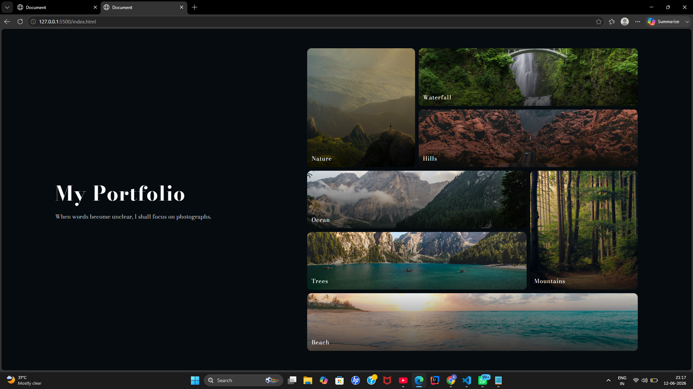

# 🖼️ Image Gallery Website

A simple and responsive **Image Gallery project** built using HTML and CSS.  
It showcases nature-themed images using a modern CSS Grid layout with hover effects.

---

## 🚀 Live Demo
👉 https://KeertiYadav-code.github.io/PICTURE-GALLERY/

---

## 📸 Preview

  

---

## 🛠️ Tech Stack
- HTML5
- CSS3 (Flexbox + Grid)
- Google Fonts

---

## ✨ Features
- Responsive image gallery layout
- CSS Grid-based design
- Hover zoom effects on images
- Dark theme with gradient background
- Clean and modern UI design

---

## 📂 Project Structure
